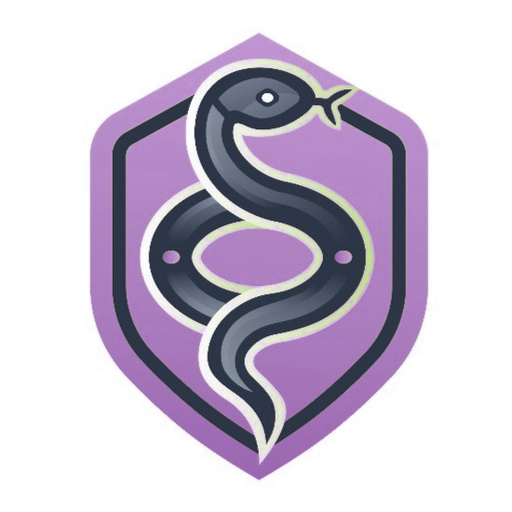

# Venom Verse



A medical-focused mobile application designed to identify venomous snakes, spiders and insects and provide emergency guidance.

## Table of Contents
- [Overview](#overview)
- [Features](#features)
- [Technologies Used](#technologies-used)
- [Installation](#installation)
- [Usage](#usage)
- [API Endpoints](#api-endpoints)
- [Machine Learning Models](#machine-learning-models)
- [Future Enhancements](#future-enhancements)
- [Contributing](#contributing)
- [Contact](#contact)

## Overview

Venom Verse is a medical-focused mobile application designed to identify snakes, spiders, and insects through images. It assesses whether a detected species is venomous and provides recommended actions in critical situations. Additionally, the app generates automatic report and send it to user email.

The app is particularly useful for:
- Wildlife enthusiasts
- Hikers and adventurers
- Medical professionals
- General users seeking immediate guidance on venomous bites

## Features

- **Image-Based Identification**: Identify snakes, insects, and spiders by uploading an image.
- **Poison Severity Prediction**: Predicts the severity of venomous bites and provides emergency recommendations.
- **Emergency Response Actions**: Provides first-aid guidance and recommended medical actions in case of a lethal bite.
- **Report Generation**: Automatically generates reports containing image analysis, severity level, and recommended steps.

## Technologies Used

### Frontend
- **Flutter (Dart)** - Cross-platform mobile development framework

### Backend
- **Flask (Python)** - For API services and model hosting
- **TensorFlow / Keras** - For machine learning model implementation

### Database
- **Firebase / PostgreSQL** - Stores user data, reports, and app logs

### Hosting & Deployment
- **DigitalOcean Droplet** - Hosting the Flask API and ML models

## Installation

### Prerequisites

Ensure you have the following installed:
- Flutter (latest stable version)
- Python 3.8+
- pip and virtualenv
- Firebase CLI (if using Firebase)

### Steps

1. Clone the repository:
```bash
git clone https://github.com/your-repo/venomverse.git
cd venomverse 
```

2. Set up the backend:
```bash
cd backend/Full_Backend
python -m venv venv
source venv/bin/activate  # (Windows: venv\Scripts\activate)
pip install -r requirements.txt
python app.py
```

3. Set up the Flutter app:
```bash
cd ../../App
flutter pub get
flutter run
```

## Usage

1. Open the app and upload an image or take a picture using device camera of a snake, insect, or spider.
2. Wait for processing, as the app identifies the species and predicts its venom level.
3. View results, including severity analysis and recommended actions.
4. Save reports for medical reference or future use and its automaticaly send to your user eamil.

## API Endpoints

### 1. Image Identification

**POST /identify**

#### Request:
```json
{
    "file": file_path.jpg,
    "model_id": 3,
}
```

#### Response:
```json
{
    "confidence": 0.9991381168365479,
    "model_id": 3,
    "prediction": 0
}
```

## Machine Learning Models

### 1. Inception V3 Model
- Used for species classification based on images.
- Trained on a custom dataset of insects, snakes, and spiders.

## Future Enhancements

- **Community Contributions**: Users can add new species and improve identification accuracy.
- **Live Chat with Experts**: Integrating an AI chatbot or expert helpline for real-time assistance.

## Contributing

1. Fork the repository.
2. Create a new branch:
```bash
git checkout -b feature-name
```
3. Commit changes:
```bash
git commit -m "Added new feature"
```
4. Push to branch:
```bash
git push origin feature-name
```
5. Submit a Pull Request.

## Contact

**For inquiries, contributions, or reporting issues, contact:**

**Email:** venomversese91@gmail.com